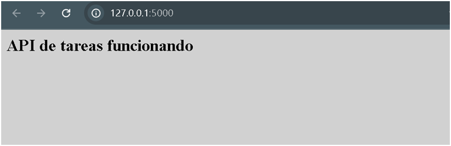
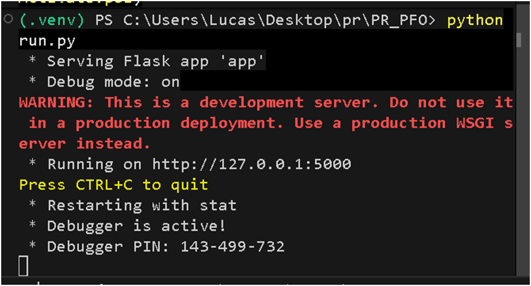
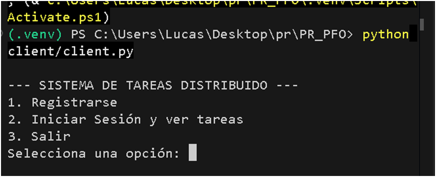
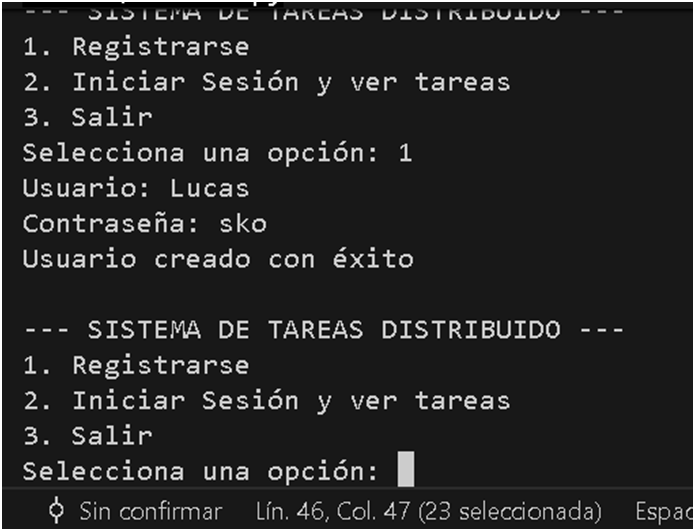
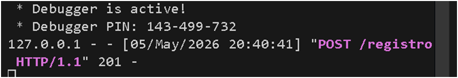
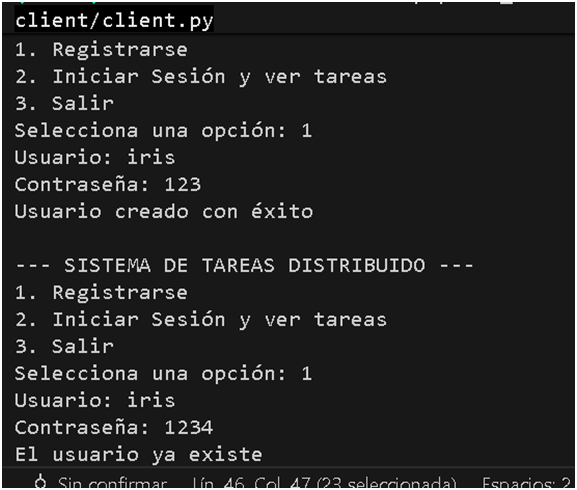
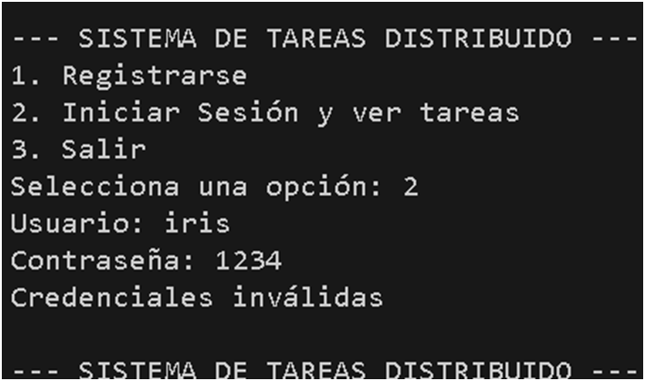
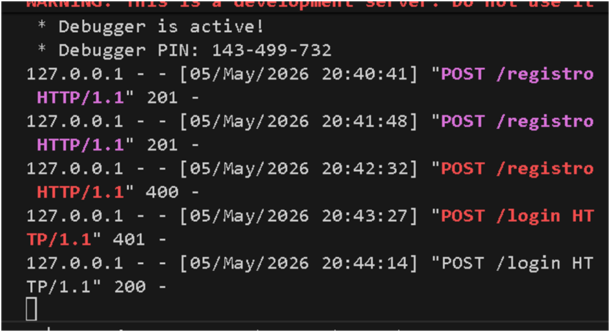
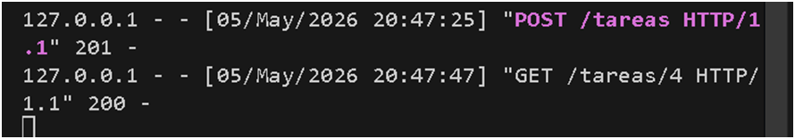

# Sistema de Gestión de Tareas Distribuido

Este proyecto consiste en implementar una API REST con Flask para la gestión de tareas, incluyendo registro de usuarios, autenticación y CRUD de tareas. Utilice SQLite para persistencia de datos y hashing de contraseñas para seguridad.

## Requisitos

- Python 3.8+
- Librerías: Flask, Flask-SQLAlchemy, requests

## Instalación

1. Clona el repositorio:

   git clone https://github.com/lucassko405/PR_PFO.git


2. Crea un entorno virtual desde windows powershell 

python -m venv venv
.\venv\Scripts\Activate.ps1


3. Instala las dependencias:

   pip install -r requirements.txt


## Uso del sistema

1. Ejecutar el servidor:
   python run.py

2. Ejecutar el cliente en otra terminal:
   python client/client.py

3. Desde el cliente:
   - Registrarse
   - Iniciar sesión
   - Crear tareas
   - Listar tareas

## Endpoints de la API

- `GET /tareas`: Página de bienvenida (HTML).
- `POST /registro`: Registrar un nuevo usuario.
  - Body: `{"username": "usuario", "password": "contraseña"}`
- `POST /login`: Iniciar sesión.
  - Body: `{"username": "usuario", "password": "contraseña"}`
- `GET /tareas/<user_id>`: Listar tareas de un usuario.
- `POST /tareas`: Crear una nueva tarea.
  - Body: `{"titulo": "Título", "descripcion": "Descripción", "usuario_id": 1}`

## Pruebas

### Registro de Usuario
```bash
curl -X POST http://localhost:5000/registro -H "Content-Type: application/json" -d '{"username": "testuser", "password": "testpass"}'
```

### Inicio de Sesión

curl -X POST http://localhost:5000/login -H "Content-Type: application/json" -d '{"username": "testuser", "password": "testpass"}'


### Crear Tarea

curl -X POST http://localhost:5000/tareas -H "Content-Type: application/json" -d '{"titulo": "Mi tarea", "descripcion": "Descripción", "usuario_id": 1}'


### Listar Tareas

curl http://localhost:5000/tareas/1


## Capturas de Pantalla

1. Ejecución del servidor.



2. Registro de usuario


3. Inicio de sesión.




4. Creación de tarea.

5. Listado de tareas.



## Respuestas Conceptuales

### ¿Por qué hashear contraseñas?

Hashear contraseñas es crucial para la seguridad porque:

- **Protección contra robo de datos**: Si la base de datos es comprometida, los hashes no revelan las contraseñas originales.
- **Irreversibilidad**: Los algoritmos de hashing como PBKDF2 o bcrypt son de una sola vía, lo que significa que no se pueden "desencriptar".
- **Resistencia a ataques**: Hace que los ataques de fuerza bruta o diccionario sean mucho más difíciles y lentos.
- **Cumplimiento de estándares**: Es una práctica estándar en seguridad de aplicaciones web.


### Ventajas de usar SQLite en este proyecto

- **Simplicidad**: No requiere un servidor de base de datos separado; es un archivo único.
- **Portabilidad**: El archivo de base de datos se puede mover fácilmente entre entornos.
- **Integración con Python**: SQLAlchemy facilita el uso de SQLite en aplicaciones Flask.
- **Transacciones ACID**: Garantiza integridad de datos sin configuración adicional.

## Estructura del Proyecto

.
PR_PFO/
├── app/
│   ├── __init__.py
│   ├── models.py
│   └── routes.py
├── client/
│   └── client.py
├── instance/
│   └── gestion_tareas.db
├── run.py
├── requirements.txt
└── README.md